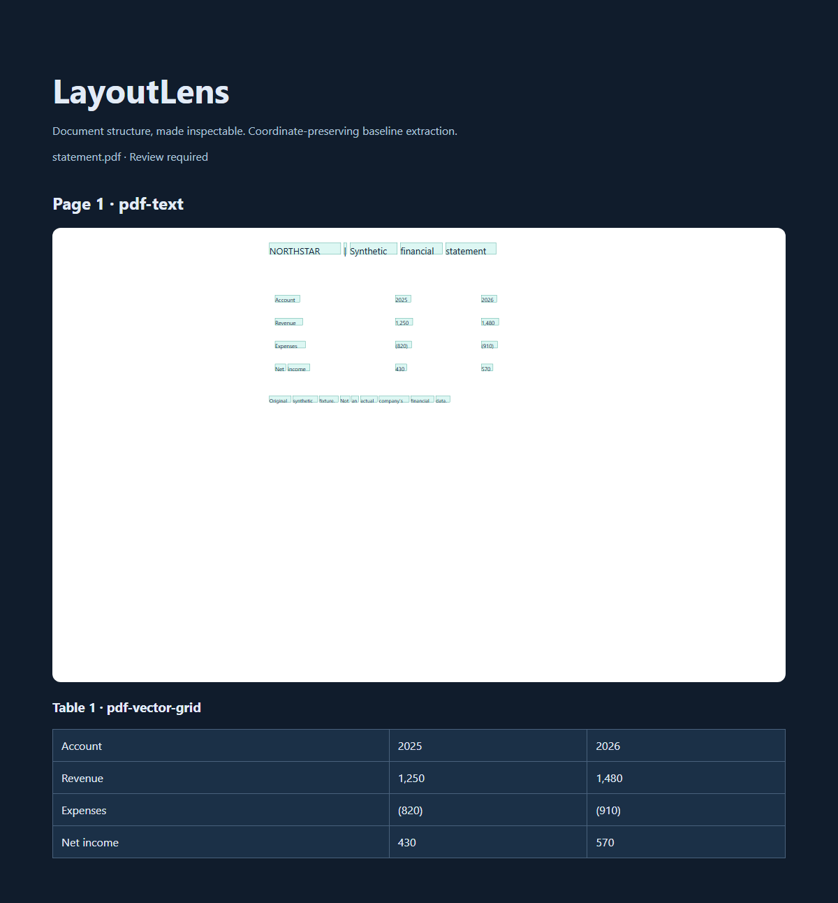
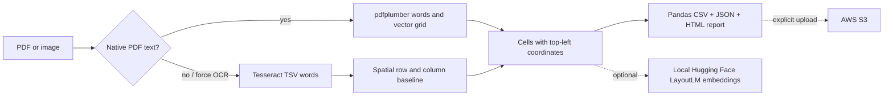

# LayoutLens

**Inspect document tables, preserve their coordinates, export reusable data.**

[](https://github.com/dileepreddy27/layoutlens/actions/workflows/verify.yml)

LayoutLens is a local Python document-parsing demonstration for financial statements and receipt-like images. It turns PDF text and vector grids, or Tesseract OCR words, into inspectable JSON, per-table CSV, normalized numeric values, and an HTML coordinate report. The useful engineering core is provenance: each word and table cell retains the location used to reconstruct it.

This is a baseline and research integration project, not an enterprise document understanding service. The synthetic demo does not establish accuracy on financial or legal documents in the wild.



## Demo

```bash
python -m pip install -e '.[dev]'
layoutlens extract fixtures/statement.pdf --out outputs/statement
# Open outputs/statement/report.html in your browser.
```

If the console script is not on PATH, replace `layoutlens` with `python -m layoutlens.cli`.

The original synthetic statement includes 12 cells, including `Net income`, grouped thousands, and parenthesized negative amounts. Native PDF extraction requires no OCR binary, network connection, cloud account, or model weights after dependencies are installed.

For the image-only receipt, install Tesseract (`sudo apt-get install tesseract-ocr` on Ubuntu; on Windows install a trusted Tesseract distribution and add its executable to PATH), then run:

```bash
layoutlens extract fixtures/receipt.png --out outputs/receipt
layoutlens extract fixtures/statement.pdf --force-ocr --out outputs/scanned
```

`--force-ocr` renders the PDF at 150 DPI and runs real OCR; it does not use the expected fixture answers. CI installs Tesseract and checks the receipt against eight expected cells.

## Architecture and actual stack



- **Python / pdfplumber:** extract embedded PDF words and ruled tables. Coordinates are PDF points with a top-left origin.
- **Tesseract:** real OCR subprocess with a 60-second timeout, word boxes and confidence scores. OCR coordinates are pixels. English, page segmentation mode 6.
- **Custom spatial reconstruction:** cluster words by vertical position, merge nearby words into cells, and group consecutive rows with aligned column starts. This handles the simple borderless receipt fixture; it is not a general table detector.
- **Pandas:** export rectangular CSV. Raw text stays in JSON; a separate normalized JSON conservatively converts US-style financial amounts. CSV formula prefixes are quoted for spreadsheet consumers.
- **Hugging Face LayoutLM:** optional adapter runs an explicitly supplied local checkpoint on normalized 0–1000 boxes and tokens, returning contextual word embeddings. It is not connected to table decisions and has no trained classification head. Long pages fail explicitly rather than silently truncating.
- **AWS S3:** explicit JSON upload adapter using boto3's credential chain and SSE-S3. No cloud calls occur during extraction.

## Outputs and inspection

Each extraction directory contains `document.json`, `report.html`, and per-table `page-N-table-M.csv` / `.normalized.json` files. JSON includes source method, coordinate units, dimensions, OCR confidence when available, cell boxes, and review warnings. The HTML report shows text-box geometry and tables; it is a reconstruction, not the original page background. It escapes document text and does not fetch external resources.

```bash
# Optional dependencies; separately provision a compatible LayoutLM checkpoint locally.
python -m pip install -e '.[layoutlm,s3]'
layoutlens features outputs/statement/document.json --checkpoint /path/to/local/layoutlm --out outputs/features.json
# Writes an object only when explicitly invoked, using your AWS credentials.
layoutlens upload outputs/statement/document.json --bucket YOUR_BUCKET --key layoutlens/document.json
```

The feature adapter expects a fast LayoutLM tokenizer and compatible LayoutLM model files. Base LayoutLM encodes text and geometry, not raw image pixels; this project does not claim an image encoder or multimodal fine-tuning. Download and license-review the checkpoint separately.

## Verification

```bash
python -m pytest -q
python -m ruff check .
python docs/generate_fixtures.py  # Recreate the original synthetic examples
```

Tests compare actual extraction against separately stored expected cell text, validate coordinate preservation and numeric normalization, and exercise input limits, corrupt files, missing OCR, and report/CSV escaping. CI runs both the PDF and real Tesseract demos and saves downloadable extraction reports. See [verification evidence](docs/VERIFICATION.md) for measured results and explicitly unrun paths.

## Boundaries and tradeoffs

- Ruled PDF tables are the strongest supported path. Borderless table inference can confuse aligned prose with tables. Multi-column reading order, nested tables/charts, rotated text, handwriting, merged-cell semantics, multilingual OCR and legal clause classification are not solved.
- There is no training, test-set benchmark, accuracy guarantee, throughput claim, or production deployment. The two synthetic documents are functional regression fixtures, not a representative evaluation corpus.
- Input defaults cap bytes at 25 MB and PDF pages at 30. Images cap at 30 megapixels. This CLI is not a hardened upload service: run untrusted documents in an isolated process/container with external memory and time limits.
- Outputs can contain sensitive source text. There is no authentication, tenancy, retention policy, encrypted local storage, or compliance certification. Legal output requires qualified human review.
- Native PDF words have no OCR confidence score; no fabricated confidence is assigned. Optional model and cloud integrations require separate validation in the target environment.

## Portfolio evidence

- Built a Python pipeline that preserves word and table-cell coordinates while exporting PDF and OCR data to JSON, CSV, and an inspectable HTML report.
- Implemented spatial row reconstruction, conservative financial normalization, and automated regression checks against original synthetic document fixtures.
- Added optional local Hugging Face LayoutLM feature extraction and explicit S3 JSON upload adapters; neither adapter implies trained table recognition or validated cloud operation.

MIT licensed. See [data and dependency provenance](docs/PROVENANCE.md).
